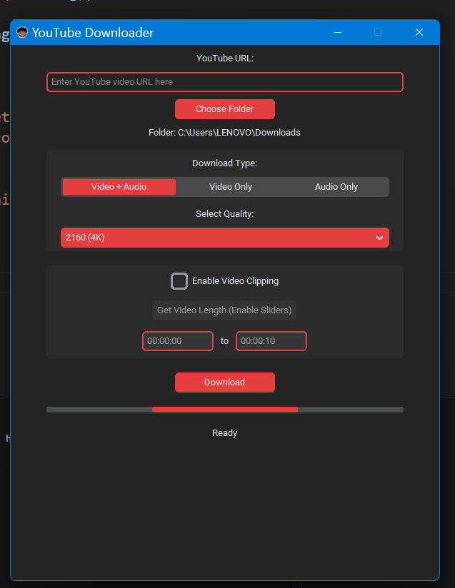
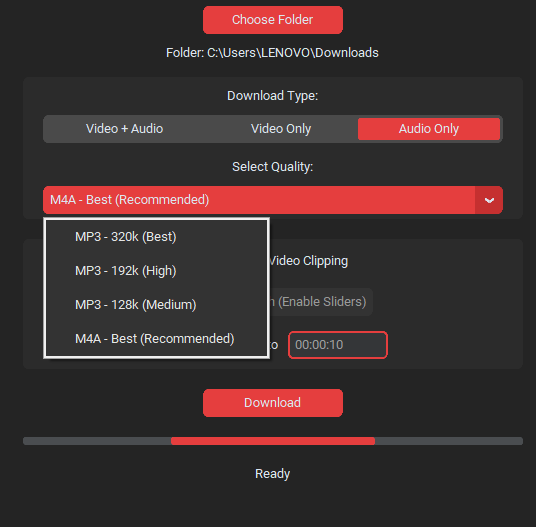

<h1 align="center">🔴 PyRed YouTube Downloader & Clipper</h1>

<p align="center">
<b><i>A professional, dark-themed desktop application built with Python.</i></b><br>
Download YouTube videos and audio in high quality with a modern <b>Red & Dark UI</b>.
</p>

<hr>

<h2>✨ Features Showcase</h2>

<h3>🎨 Modern Dark Interface</h3>
<ul>
  <li>Built using <b>CustomTkinter</b></li>
  <li>Custom <b>Red Theme (#E53E3E)</b></li>
  <li>Automatic Windows 11 red title bar integration</li>
</ul>

<p align="center">

</p>

<hr>

<h3>🎞️ High-Quality Video Support</h3>
<ul>
  <li>Supports <b>720p → 4K (2160p)</b></li>
  <li>Powered by <b>yt-dlp</b></li>
</ul>

<p align="center">

</p>

<hr>

<h3>🎵 Flexible Audio Extraction</h3>
<ul>
  <li>Audio-only downloads</li>
  <li>Formats: <b>MP3 / M4A</b></li>
  <li>High-bitrate support</li>
</ul>

<p align="center">

</p>

<hr>

<h3>✂️ Advanced Video Clipper</h3>
<ol>
  <li>Enable <b>"Video Clipping"</b></li>
  <li>Click <b>"Get Video Length"</b></li>
  <li>Use interactive sliders to select start & end time</li>
</ol>

<p align="center">

</p>

<hr>

<h3>🚀 Real-Time Progress</h3>
<ul>
  <li>Threaded background downloads</li>
  <li>UI remains responsive</li>
  <li>Live progress bar updates</li>
</ul>

<hr>

<h2>🛠️ Prerequisites</h2>

<ul>
  <li><b>Python 3.10+</b> – https://www.python.org</li>
  <li><b>FFmpeg</b> (Required for merging & clipping)</li>
</ul>

<hr>

<h2>📦 Installation & Setup</h2>

<h3>Step 1: Create Virtual Environment (Recommended)</h3>

```bash
python -m venv venv
 ```


<b>Activate Environment</b>

Windows:

```bash
venv\Scripts\activate
```

Mac / Linux:

```bash
source venv/bin/activate
```

<hr>

<h3>Step 2: Install Dependencies</h3>

```bash
pip install customtkinter yt-dlp
```

<hr>

<h3>Step 3: Setup FFmpeg (CRITICAL 🚨)</h3>

<p><b>The app will not work without ffmpeg.exe</b></p>

<ol>
  <li>Download FFmpeg (Essentials build) from <b>gyan.dev</b></li>
  <li>Open ZIP → go to <code>bin</code></li>
  <li>Copy <code>ffmpeg.exe</code></li>
  <li>Paste it next to <code>hlo.py</code></li>
</ol>

<pre>
YouTubeDownloader/
│
├── ffmpeg.exe   &lt;-- REQUIRED
├── hlo.py       &lt;-- Main Script
└── README.md
</pre>

<hr>

<h2>🚀 How to Run</h2>

```bash
python hlo.py
```

<hr>

<h2>🎮 How to Use</h2>

<ul>
  <li><b>Paste URL:</b> Insert YouTube link</li>
  <li><b>Select Format:</b> Video + Audio / Video Only / Audio Only</li>
  <li><b>Choose Quality:</b> 720p, 1080p, 4K or audio bitrate</li>
  <li><b>Clip Video (Optional):</b>
    <ul>
      <li>Enable clipping</li>
      <li>Get video length</li>
      <li>Adjust sliders</li>
    </ul>
  </li>
  <li><b>Download:</b> Choose save location</li>
</ul>

<hr>

<h2>⚠️ Troubleshooting</h2>

<b>FFmpeg Error / Crash</b>

<p>Ensure <code>ffmpeg.exe</code> is in the same folder as <code>hlo.py</code></p>

<b>Title Bar Not Red</b>

<p>Only supported on Windows 11</p>

<b>Slow Downloads</b>

<p>4K videos may be throttled — retry download</p>

<b>ModuleNotFoundError</b>

```bash
pip install customtkinter yt-dlp
```

<hr>

<h2>📄 License</h2>
<p>Open-source project for educational purposes.</p>

<hr>

<h2>⚠️ Disclaimer</h2>
<p>
Respect YouTube’s Terms of Service and copyright laws.<br>
Only download content you have permission to use.
</p>
```

