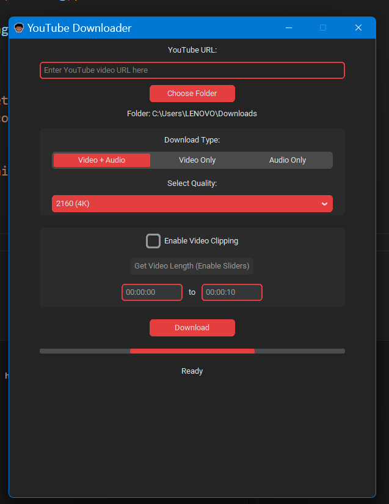
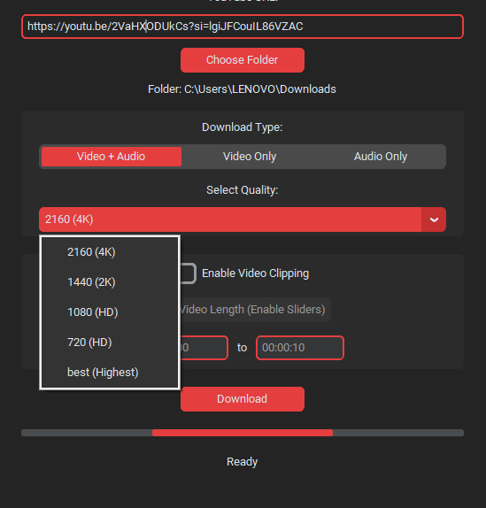
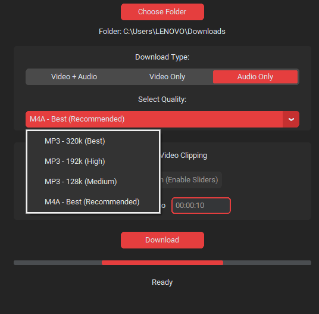
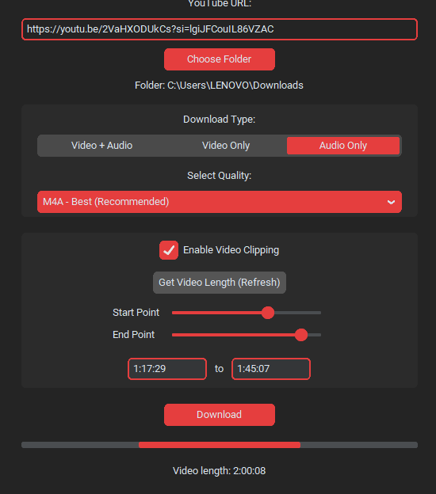

# 🔴 PyRed — YouTube Downloader & Clipper

A modern desktop YouTube video/audio downloader and clipper with a dark, red-accented UI, built in Python with **CustomTkinter** and powered by **yt-dlp**.

> ⚠️ **Educational project.** Only download content you have the right to download, and respect YouTube's Terms of Service and applicable copyright law.

---

## Features



- **High-Quality Video Downloads**: 720p, 1080p (HD), 1440p (2K), up to 4K (2160p) via yt-dlp.
- **Audio Extraction**: Direct MP3 extraction (128k, 192k, 320k high-bitrate) or native M4A.
- **Video Clipping**: Fetch video duration, pick start and end timestamps via sliders or manual time inputs, and download only the trimmed section.
- **Real-Time Determinate Progress Bar**: Tracks accurate percentage (0–100%), real-time download speed in MB/s, and ETA.
- **Smart FFmpeg Detection**: Auto-detects FFmpeg from Windows system PATH (`winget`), the application folder, or PyInstaller package.
- **Playlist Protection**: Prevents accidental batch downloads when pasting URLs containing `&list=`.
- **Custom Dark Red Theme**: Sleek UI with Windows 11 title bar accent matching `#E53E3E`.

| Video quality | Audio quality | Clipping |
|---|---|---|
|  |  |  |

---

## Requirements

| Requirement | Notes |
|---|---|
| Python 3.10+ | [python.org](https://www.python.org) |
| FFmpeg | Required for merging video+audio and MP3 conversion |

Python packages: `customtkinter`, `yt-dlp`, `pyinstaller` (defined in `requirements.txt`).

---

## Installation & Setup

1. **Clone the repository**
   ```powershell
   git clone https://github.com/srikar-up/youtube-download.git
   cd youtube-download
   ```

2. **Create and activate a virtual environment**
   ```powershell
   python -m venv venv
   .\venv\Scripts\Activate.ps1
   ```

3. **Install dependencies**
   ```powershell
   pip install -r requirements.txt
   ```

4. **Install FFmpeg**
   - **Recommended (Windows winget):**
     ```powershell
     winget install Gyan.FFmpeg
     ```
   - **Manual alternative:**
     Download `ffmpeg.exe` from [gyan.dev](https://www.gyan.dev/ffmpeg/builds/) and place `ffmpeg.exe` in the project root next to `hlo.py`.

---

## Running the App

Run directly from Python:

```powershell
python hlo.py
```

---

## Compiling Standalone `.exe`

To package the application into a single standalone Windows executable (with no black console window):

```powershell
pyinstaller --noconsole --onefile --collect-all customtkinter --name "PyRed-Downloader" hlo.py
```

> **Note:** The `--collect-all customtkinter` flag is essential to ensure CustomTkinter's dark theme JSON files and fonts are bundled inside the `.exe`.

Once compilation finishes, the executable will be located in:
```
dist\PyRed-Downloader.exe
```

You can move `PyRed-Downloader.exe` anywhere on your PC and run it directly!

---

## Usage

1. **Paste URL**: Enter any valid YouTube video link.
2. **Choose Format**: Select **Video + Audio**, **Video Only**, or **Audio Only**.
3. **Pick Quality**: Choose desired resolution (up to 4K) or audio bitrate.
4. *(Optional)* **Clip Video**:
   - Check **Enable Video Range Clipping**.
   - Click **Fetch Video Duration**.
   - Adjust the start and end sliders or type timestamps (`HH:MM:SS`).
5. **Download**: Choose your output destination and click **Download Now**.

---

## Troubleshooting

| Problem | Fix |
|---|---|
| FFmpeg warning / error | Install via `winget install Gyan.FFmpeg` or place `ffmpeg.exe` in the app directory |
| Video extraction errors | YouTube frequently updates its site. Run `pip install -U yt-dlp` to keep the downloader up to date |
| Red title bar not visible | Title bar color accenting is supported on Windows 11 |

---

## License

Released under the [MIT License](LICENSE). Provided for educational purposes only.
